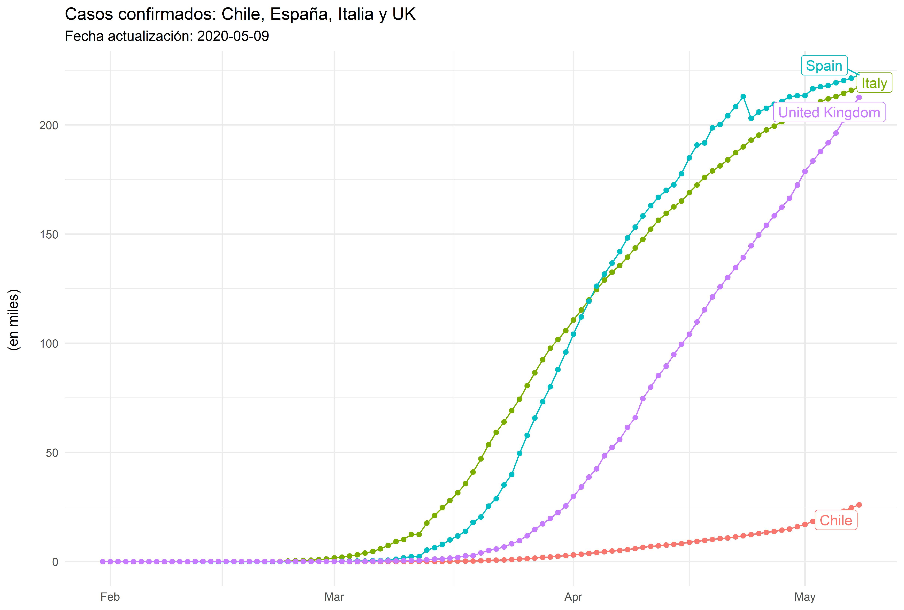

# COVID-19 (Johns Hopkins University)

<!-- badges: start -->
<!-- badges: end -->

Este es un repositorio que almacena datos COVID-19 proporcionados por la Universidad de John Hopkins (jhu), el script.R almacena los códigos para la visualización de los contagios y muertes diarias por país.

## Casos fallecidos en cuatro paises al 9 de mayo de 2020 

